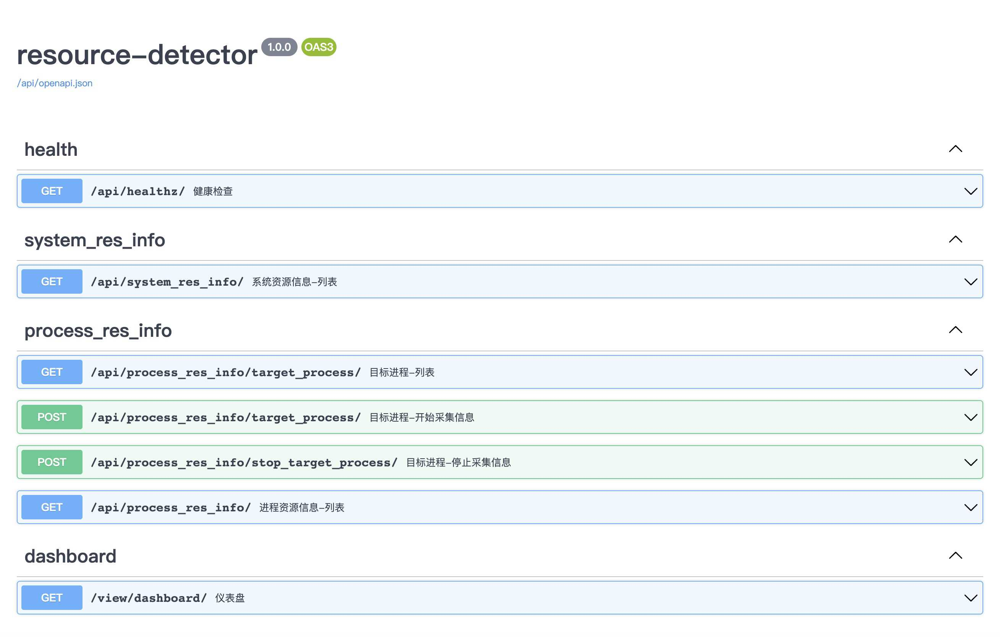
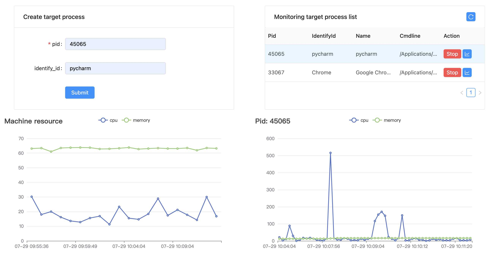

# resource-detector

- 项目名称：进程内存和 CPU 使用情况采集器 demo
- 版本：v1.0
- 基本功能：
  - 使用 fastapi 对外暴露 api 服务，提供创建目标进程(pid)资源采集任务以及获取资源信息接口
  - fastapi 启动时会顺便创建两个死循环线程，用于采集系统以及目标进程资源信息，任务间隔为 60 秒（过长）
  - 系统和目标进程资源信息都持久化到了本地 sqlite，暂时没有自动清理数据功能（数据量过多时会占用大量硬盘空间） 
- 安装和启动：
  ```
  pip install -r requirements.txt
  python run.py
  ```
- swagger 地址：http://0.0.0.0:7777/api/docs


- dashboard 地址：http://0.0.0.0:7777/view/dashboard/


- 下个版本计划：
  - 指定进程资源获取优化：[issue1 ](https://github.com/fl-flow/resource-detector/issues/1)
    - 目标进程资源信息的采集时间间隔需要从 60 秒缩短为 1 秒
    - 目标进程列表维护在内存里，不要每次循环都去读取数据库
    - 获取进程资源信息是个阻塞操作，目标进程的资源获取操作需要使用子进程进行（一个 pid 进程或者几个 pid 一个进程）
  - 滑动窗口数据接口：[issue 2](https://github.com/fl-flow/resource-detector/issues/2)
    - 资源信息需要提供滑动窗口数据接口
    - 接口要采用 sse 的形式